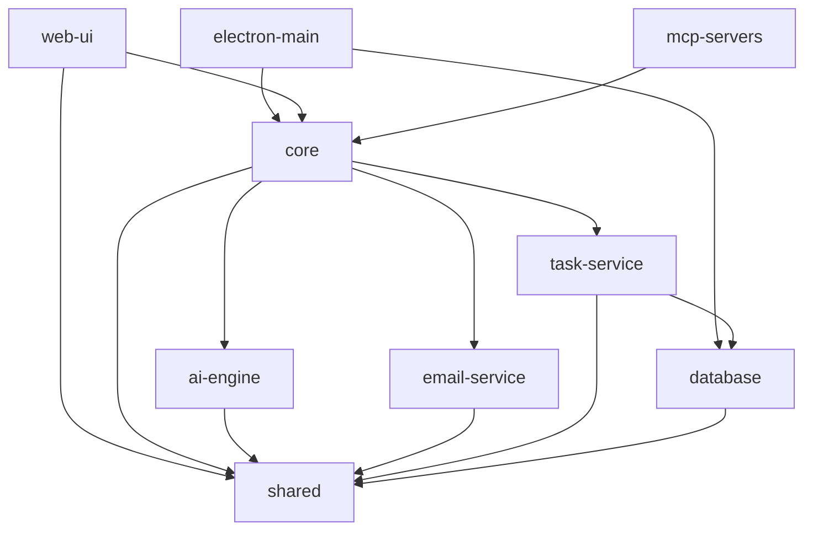

# モノレポ構成

## 概要
秘書AIエージェントアプリケーションのモノレポ構成。npm workspacesを使用して管理。

## ディレクトリ構造

```
secretary-agent/
├── packages/
│   ├── electron-main/       # Electronメインプロセス
│   ├── web-ui/             # React UI (レンダラープロセス)
│   ├── core/               # コアビジネスロジック
│   ├── ai-engine/          # AI解析エンジン
│   ├── email-service/      # メール監視サービス
│   ├── task-service/       # タスク管理サービス
│   ├── database/           # データベース層
│   ├── shared/             # 共通型定義・ユーティリティ
│   └── mcp-servers/        # MCPサーバー拡張
│       ├── calendar/
│       ├── file-system/
│       └── web-search/
├── docs/
├── scripts/                # ビルド・デプロイスクリプト
├── .github/               # GitHub Actions
├── package.json           # ルートpackage.json
├── tsconfig.json         # 共通TypeScript設定
├── .eslintrc.js         # 共通ESLint設定
└── turbo.json           # Turborepo設定（オプション）
```

## 各パッケージの役割

### packages/electron-main
- Electronのメインプロセス
- IPCハンドラー
- システムトレイ管理
- ウィンドウ管理

### packages/web-ui
- React + TypeScript
- UIコンポーネント
- 状態管理（Zustand）
- ルーティング

### packages/core
- ビジネスロジックの中核
- ワークフロー管理
- イベントバス

### packages/ai-engine
- LLM API統合（OpenAI/Claude）
- プロンプト管理
- レスポンス解析

### packages/email-service
- IMAP/APIクライアント
- メール監視
- メールパーサー

### packages/task-service
- タスク生成・管理
- 優先度計算
- タスクキュー

### packages/database
- SQLite統合
- マイグレーション
- DAOレイヤー

### packages/shared
- 共通型定義
- ユーティリティ関数
- 定数定義

### packages/mcp-servers
- MCP仕様に準拠したサーバー
- プラグイン形式で拡張可能

## package.json構成

### ルートpackage.json
```json
{
  "name": "secretary-agent",
  "private": true,
  "workspaces": [
    "packages/*",
    "packages/mcp-servers/*"
  ],
  "scripts": {
    "dev": "npm run dev --workspaces",
    "build": "npm run build --workspaces",
    "test": "npm run test --workspaces",
    "lint": "eslint packages/*/src/**/*.{ts,tsx}",
    "typecheck": "tsc --noEmit"
  },
  "devDependencies": {
    "@types/node": "^20.0.0",
    "eslint": "^8.0.0",
    "prettier": "^3.0.0",
    "typescript": "^5.0.0"
  }
}
```

### 各パッケージのpackage.json例（packages/core/package.json）
```json
{
  "name": "@secretary-agent/core",
  "version": "0.1.0",
  "main": "dist/index.js",
  "types": "dist/index.d.ts",
  "scripts": {
    "dev": "tsc --watch",
    "build": "tsc",
    "test": "jest"
  },
  "dependencies": {
    "@secretary-agent/shared": "workspace:*"
  }
}
```

## 依存関係



## 開発フロー

1. **独立開発**: 各パッケージは独立して開発・テスト可能
2. **共通設定**: TypeScript、ESLint設定は共有
3. **バージョン管理**: workspace:*を使用してパッケージ間の依存を管理
4. **ビルド順序**: 依存関係に基づいて自動的に順序付け

## CI/CD考慮事項

- 変更があったパッケージのみビルド・テスト
- パッケージ間の依存関係を考慮したビルド順序
- Electronアプリのパッケージングは最終ステップ